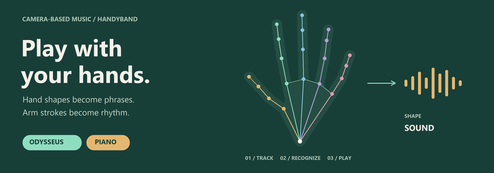
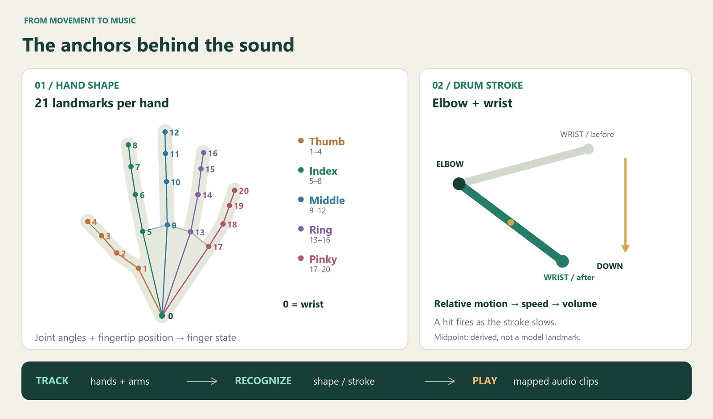
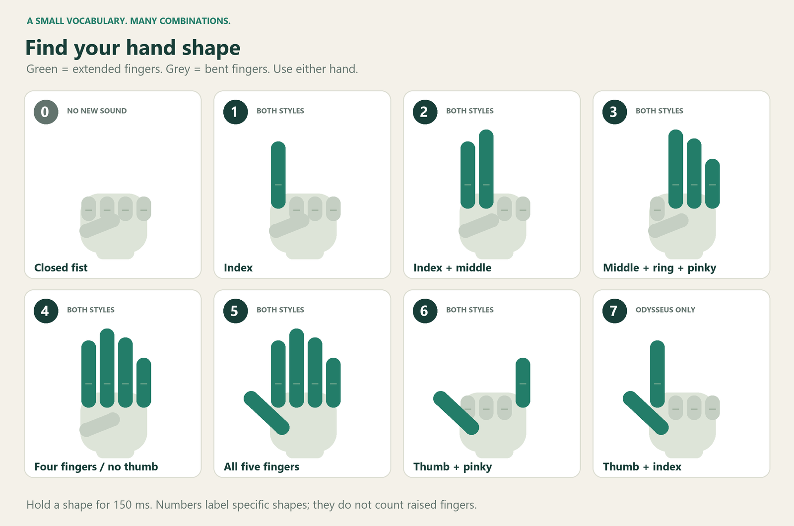

# HandyBand

**Your hands. Your rhythm. Your band.**

Turn everyday hand movements into music. HandyBand uses a camera to track your hands and forearms, recognize deliberate gestures, and play recorded sounds in real time. Shape a phrase with your fingers, add a beat with a downward arm stroke, or combine both hands into a piano performance.



**[Play in your browser](https://boyiiiisun.github.io/HandyBand/)** · **[Download for Windows](https://github.com/Boyiiiisun/HandyBand/releases/tag/v1.0.1)** · **[Development guide](docs/development.md)**

No wearable sensors or MIDI controller required: just a camera, audio output, and room to move. This guide focuses on two musical styles: **Odysseus** and **Piano**.

## From movement to music

```text
Camera frames → Hand / arm landmarks → Gesture recognition → Recorded audio
```

HandyBand combines MediaPipe landmark detection with geometric gesture rules. The model locates the hands and joints; the application decides which hand shape or arm movement should trigger a sound. It plays a curated set of audio clips rather than synthesizing arbitrary notes from hand position.



### Read the hand

Up to **two hands** are tracked, with **21 landmarks per hand**: one wrist point and four points along each finger. The colored chains in the diagram connect the joints; points **4, 8, 12, 16, and 20** are the fingertips.

For each finger, HandyBand checks two joint angles and whether the fingertip extends farther from the wrist than its first tested joint. The resulting five extended/bent states form a numbered hand shape. A shape must remain stable for **150 ms** before it can trigger an event. Each hand has its own recognition and retrigger timing.

### Read the rhythm

In Odysseus, a separate pose tracker supplies **elbow and wrist anchors**. HandyBand measures downward wrist motion relative to the elbow, normalizes it by forearm length, and smooths the estimated speed. A stroke must travel far enough and finish with sufficient average speed to become a drum hit; small movements are filtered out.

The hit fires as the downstroke slows. Faster accepted strokes produce louder hits within a bounded volume range, followed by a **500 ms cooldown per arm**. The drum gesture does **not** require a particular finger shape, so rhythm and hand-shape control can be combined.

*The illustrations show tracking geometry, not screenshots or measured motion traces. Hand and pose landmark numbers belong to separate models; the forearm midpoint is derived from the elbow and wrist.*

## Two ways to play

| | Odysseus | Piano |
| --- | --- | --- |
| Musical idea | Layer oboe clips and a drum beat | Combine two banks of piano clips |
| Hand shapes | 1–7 | 1–6 |
| Left / right hand | Same seven clips, independently triggered | Six distinct clips for each hand |
| Arm movement | Downstroke triggers the drum | No arm gesture required |
| Holding the same shape | Retriggers after 75 s per hand | Retriggers after 1.64 s on the left; 0.82 s on the right |

### Odysseus — shape the phrase, strike the beat

Odysseus pairs seven prerecorded oboe clips with a drum sample. Either hand selects a clip through its numbered shape; either arm can add percussion with a deliberate downward stroke. The two controls let you switch musical phrases while maintaining a physical rhythm.

**Try it:** show gesture **1** and hold it briefly to start a clip. Change to **2** to select another, then lower your forearm in a clear drum stroke and let it settle. Repeat with a faster stroke to hear the change in drum volume. Keep both the elbow and wrist in the camera frame.

Both hands use the same numbered sound bank, but trigger independently. The 75-second interval limits repeated triggering while a shape is held; changing to a different recognized shape can trigger after its own 150 ms confirmation, without waiting 75 seconds.

### Piano — give each hand a part

Piano maps six hand shapes to six piano clips **for each hand**. Your anatomical left hand selects the left bank, and your right hand selects the right bank, giving you twelve mapped clips across two independently controlled parts. No downstroke is needed.

**Try it:** hold gesture **1** with your left hand, then add gesture **2** with your right. Change one hand at a time to explore how the two banks fit together. Keep a shape steady to repeat its clip at that hand's retrigger interval, or change shape to select a new clip after confirmation.

The left hand retriggers more slowly than the right: **1.64 s versus 0.82 s**. These are trigger intervals, not a tempo-synchronization system. Each clip starts from its beginning when triggered.

### Hand-shape reference

Use these specific shapes with either hand. **The numbers are gesture labels, not simply a count of extended fingers.** For each shape, extend the listed fingers and bend the others.



| Shape | Extended fingers | Odysseus | Piano |
| --- | --- | --- | --- |
| 0 | None — closed fist | No finger clip | No finger clip |
| 1 | Index | Clip 1 | Left / right clip 1 |
| 2 | Index, middle | Clip 2 | Left / right clip 2 |
| 3 | Middle, ring, pinky | Clip 3 | Left / right clip 3 |
| 4 | Index, middle, ring, pinky | Clip 4 | Left / right clip 4 |
| 5 | Thumb, index, middle, ring, pinky | Clip 5 | Left / right clip 5 |
| 6 | Thumb, pinky | Clip 6 | Left / right clip 6 |
| 7 | Thumb, index | Clip 7 | No mapped sound |

The illustrated shapes work in both implementations. The desktop recognizer also accepts **index + middle + ring** as an alternative for gesture 3; the browser uses the illustrated **middle + ring + pinky** shape.

**Playback behavior:** browser clips can overlap and continue playing when you change shape or close your hand. On desktop, switching to another recognized shape fades out that hand's previous clips over 150 ms; a closed fist starts no replacement clip. A closed fist does not disable arm-triggered drums. Moving a hand out of view is not a universal stop command. In the browser, click **SOUND ON** to mute; the label changes to **SOUND OFF**.

## Start playing

### In your browser

1. Open **[HandyBand](https://boyiiiisun.github.io/HandyBand/)** and allow camera access. Wait for the camera and tracking models to load.
2. Click **SOUND OFF** to enable sound; the control changes to **SOUND ON**.
3. Use the first two channel buttons below the camera to choose **Odysseus** or **Piano**. The label below the screen shows the selected style.
4. Show one or both hands and hold a reference shape briefly. For Odysseus percussion, include your elbows and wrists in the frame.

Click or tap the camera display to pause tracking, then tap the pause overlay to resume. Pausing tracking stops new gesture processing; already-started audio can continue. Use the sound control to mute and **FULLSCREEN** to enlarge the workspace.

The browser version needs internet access to load its libraries, models, and audio. Camera access requires a secure context; use the hosted HTTPS page or localhost when developing. Model inference runs in the browser, and the current application does not send camera frames to a server. The camera request does not include microphone access.

### Windows app

Download **HandyBand-v1.0.1-windows-x64.zip** from [GitHub Releases](https://github.com/Boyiiiisun/HandyBand/releases/tag/v1.0.1), extract the entire archive, and double-click **HandyBand.exe**. Keep its companion files and folders together.

The portable app includes Python, dependencies, models, and published audio. It requires 64-bit Windows, a webcam, and audio output; no separate Python installation is needed. The app is unsigned. Select **Odysseus** or **Piano** from the menu in the camera window's upper-right corner. Press **Q** or **Esc**, or close the window, to exit.

### From source

On Windows, clone or download this repository and double-click **Start HandyBand.cmd**. The first launch installs the local runtime and locked dependencies and downloads the models; internet access is required. Later launches reuse these files. After updating the repository, run the same launcher again.

For a different camera, run `"Start HandyBand.cmd" --camera 1` from Command Prompt. For manual setup, local web serving, testing, and packaging, see the **[development guide](docs/development.md)**.

### Help the camera see you

- Use even lighting and keep your hands separated and fully visible.
- Start with your palms toward the camera and clear, deliberate finger shapes.
- Hold each new shape briefly instead of moving continuously between shapes.
- For drums, leave room for the elbow and wrist to remain visible throughout the stroke.

Occlusion, strong perspective, motion blur, and low frame rates can affect recognition. The hand-shape rules are geometric heuristics, so a partially bent finger may be interpreted differently from what you intended.


## License

HandyBand is licensed under the [MIT License](LICENSE).
